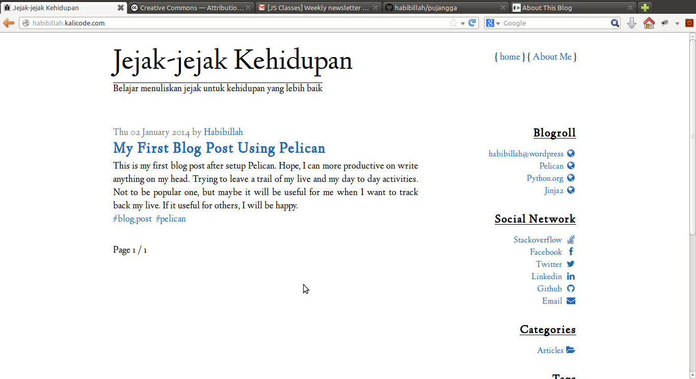

Pujangga
========

Just another Pelican site generator theme
-----------------------

The first idea for this theme come from [dbrgn blog site](http://blog.dbrgn.ch). However, some modification and change has been made to give more rich layout but still simple and minimalist. The icon on right side come from [Font Awasome](http://fontawesome.io/) and [Simple Grid](http://thisisdallas.github.io/Simple-Grid/) used to make more fluid and responsive. This theme also come with sample of [pelican config file](pelicanconf.py-sample).

This theme use customized [Hyphenator library](http://code.google.com/p/hyphenator/) to support both English and Bahasa Indonesia. If you use this theme with another language, please regenerate [hyphenator.js file]({filename}static/js/hyphenator.js) using [Hyphenator merge and pack tool](http://hyphenator.googlecode.com/svn/trunk/mergeAndPack.html).

To see live demo of this theme, instead of screenshot image, please visit [demo](http://pujangga.kalicode.com).

